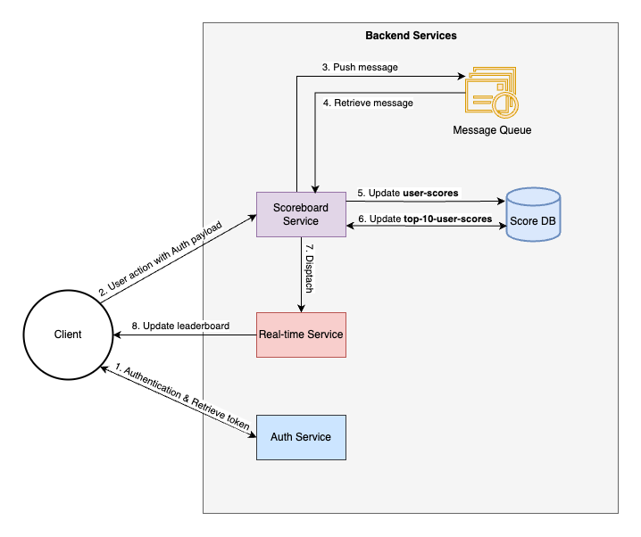

# Scoreboard Module

This module is designed to handle score updates and live scoreboard updates for a website. Users can perform certain actions that increase their scores, and these updates are reflected in real-time on the scoreboard


### Software Requirements

1. We have a website with a score board, which shows the top 10 user’s scores.
2. We want live update of the score board.
3. User can do an action (which we do not need to care what the action is), completing this action will increase the user’s score.
4. Upon completion the action will dispatch an API call to the application server to update the score.
5. We want to prevent malicious users from increasing scores without authorisation.

## System Services

### 1. Scoreboard Service

- Handles score data.
- Handles top 10 scores data.

### 2. Auth Service

- Handles user authentication and authorization.

### 3. Real-time Service

- Provides WebSocket support for live updates.

## Workflows



1. The **Client** sends credentials to the **Auth Service** to obtain an access token.
2. The **Client** sends user actions with the access token to the **Scoreboard Service**.
3. The **Scoreboard Service** validates the access token and pushes the message to the Message Queue.
4. The **Scoreboard Service** consumes the message from the Message Queue.
5. The **Scoreboard Service** updates/retrieves the score from the `user-scores` Table.
6. The **Scoreboard Service** retrieves/updates the top 10 scores from the `top-10-scores` Table.
  - Get the lowest score from the top 10 scores.
  - If the new score is higher than the lowest score, remove the lowest score and add the new score.
7. If top 10 scores are updated, the **Scoreboard Service** dispatches a message to the **Real-time Service** name `top-10-scores-updated`.
8. The **Real-time Service** sends the updated top 10 scores to all connected clients.

## API Design

Assuming the following API endpoints for the **Scoreboard Service** and we already have an API endpoint for the **Auth Service** and **Real-time Service**.


### 1. **Score Update**
- Endpoint: /v1/score-action
- Method: POST
- Description: Updates the user's score after completing an action.
- Request Body:

  ```json
  {
    "userId": "string", // can extract from access token
    "scoreAction": "string"
  }
  ```

- Response:

  ```json
  {
    "status": "success",
    "message": "Score updated successfully",
    "data": {
      "score": 100,
      "newScore": 200
    }
  }
  ```

2. **Get Top 10 Scores**
  Users can retrieve the top 10 scores from the **Scoreboard Service** via Websocket for real-time updates or via an API endpoint.

  - Endpoint: /v1/top-10-scores
  - Method: GET
  - Description: Retrieves the top 10 scores.
  - Response:

    ```json
    {
      "status": "success",
      "data": [
        {
          "userId": "string",
          "score": 100
        },
        {
          "userId": "string",
          "score": 200
        },
        ...
      ]
    }
    ```


## Technology Stack

The following technologies are suggested for the implementation of the Scoreboard Module:

- **Backend**: Node.js, WebSocket
- **Database**: MongoDB
- **Message Queue**: BullQueue
- **Authentication**: JWT token


## Enhancing performance solutions

The following solutions can be implemented to enhance the module performance in the future, as the number of users and requests increase. Currently, I have not implemented these solutions due to they could over-complicate the module and cost more development effort.

1. **Load Balancing**: Implement load balancing to distribute incoming requests across multiple instances of the **Scoreboard Service**. This will help to handle more requests and improve the system's performance.

2. **Caching**: Implement caching for the `top-10-scores` by storing the top 10 scores in a cache instead of the database. This will reduce the number of database queries and improve performance. I recommend using Redis for caching.

3. **Batch Processing**: Implement batch processing for updating the `top-10-scores`. Instead of updating the `top-10-scores` for every single request, you can pull 10-100 message from the message queue and update the `top-10-scores` in a single batch. This will reduce the number of database queries and improve performance.

4. **Database Sharding**: As the number of users and scores increase, consider implementing database sharding to distribute the database load across multiple database servers.

5. **Asynchronous Processing**: If the logic for updating Score board can be changed from real-time to every 5 minutes or 10 minutes, then we can implement asynchronous processing to update the `top-10-scores` with a cron job or scheduled task. This will reduce the load on the system and improve performance. Keep in mind that this will have a delay in updating the `top-10-scores` and trade off between real-time updates and performance.